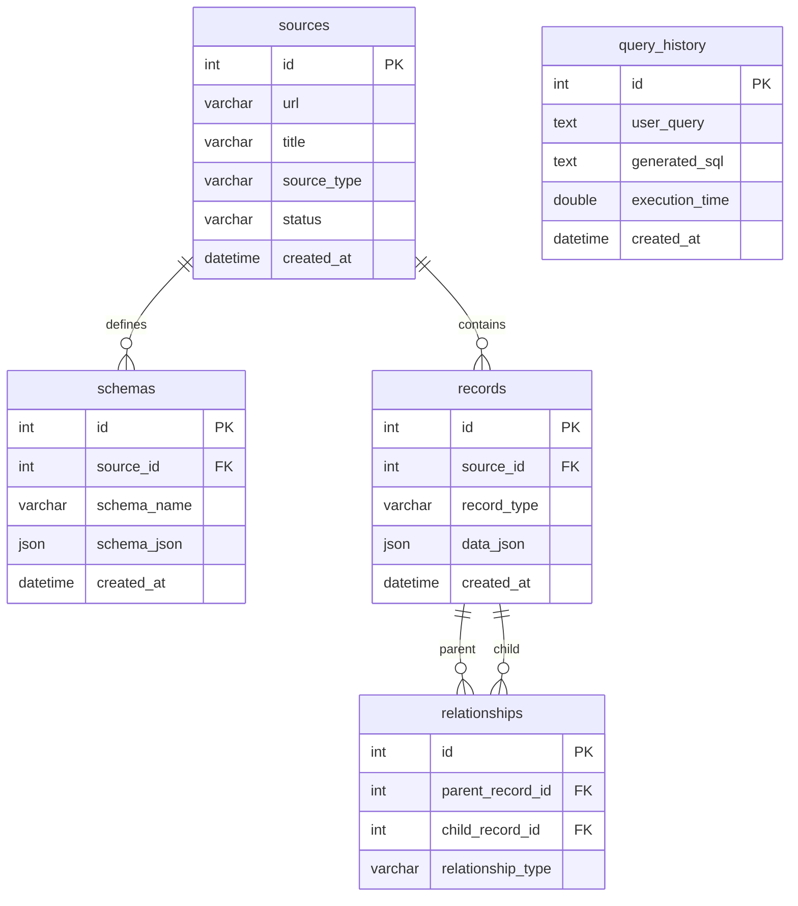
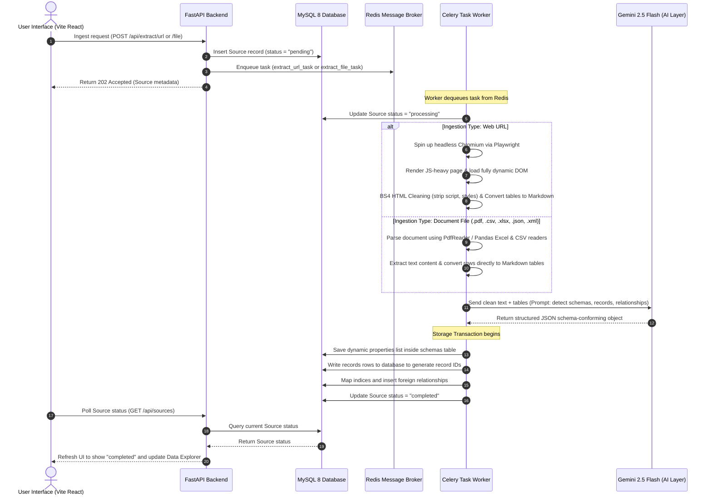

# Universal AI Data Extraction & Intelligence Platform

A production-grade SaaS platform designed for schema-less data extraction, crawling, and natural language analytics. By combining **FastAPI**, **React 19**, **Celery**, and **Gemini 2.5 Flash**, this platform ingests raw website URLs and uploads (PDF, CSV, Excel, XML, JSON, HTML), automatically infers data structure, registers dynamic schemas, stores records inside MySQL JSON columns, and enables natural language querying.

---

## 1. Directory Structure

```
a:/JalJeevanMission/llm/
├── docker-compose.yml          # Container orchestration (FastAPI, React, Celery, MySQL, Redis)
├── .env.example                # Example environment settings
├── .env                        # Active system environment parameters
├── backend/
│   ├── Dockerfile              # Setup for Python 3.12, system libs, and headless Playwright
│   ├── requirements.txt        # Backend python dependencies
│   ├── init.sql                # MySQL 8 database initializer
│   └── app/
│       ├── __init__.py
│       ├── main.py             # FastAPI entrypoint, routes, middleware, and startup tables creation
│       ├── config.py           # Configuration loader
│       ├── db.py               # SQLAlchemy database setup and connections pooling
│       ├── worker.py           # Celery task definitions (URL scrapers, file parsers, web crawlers)
│       ├── models/             # Database ORM mapping definitions
│       │   ├── __init__.py
│       │   ├── source.py
│       │   ├── schema.py
│       │   ├── record.py
│       │   ├── relationship.py
│       │   └── query_history.py
│       ├── schemas/            # Pydantic validation schemas
│       │   ├── __init__.py
│       │   ├── source.py
│       │   ├── record.py
│       │   └── query.py
│       └── services/           # Pipelines and business logic layer
│           ├── scraper.py      # Playwright browser rendering and BeautifulSoup table-to-markdown
│           ├── document_parser.py # PDF, Excel, CSV, XML, JSON parsing services
│           ├── extractor.py    # Gemini 2.5 Flash Structured JSON Extraction integration
│           ├── storage_service.py # MySQL transactions mapper for schemas & relationships
│           ├── query_engine.py # Natural Language-to-SQL translator & security validator
│           └── analytics.py    # BI insights aggregator and Recharts config recommender
└── frontend/
    ├── Dockerfile              # Setup for Vite Node.js environment
    ├── package.json            # React 19, TS, Zustand, Recharts dependencies
    ├── index.html              # Main HTML entrypoint (Outfit & Inter fonts preloads)
    ├── vite.config.ts          # Vite configuration and backend reverse-proxy setup
    ├── tailwind.config.js      # Custom theme, HSL layout, and glow animations mapping
    ├── postcss.config.js       # PostCSS plugins (Tailwind, Autoprefixer)
    ├── tsconfig.json           # TS compiler config
    └── src/
        ├── main.tsx            # App DOM mounting
        ├── App.tsx             # State router coordinating views
        ├── index.css           # Design tokens, scrollbars, and glassmorphic card classes
        ├── components/
        │   └── Layout.tsx      # Sidebar, top status indicators, and responsive panel
        ├── store/
        │   └── useStore.ts     # Zustand global store and API actions client
        └── pages/
            ├── Dashboard.tsx   # Control console, statistics cards, and activity log
            ├── Sources.tsx     # Crawler forms, file dropzones, and ingested sources grid
            ├── Explorer.tsx    # Column-adaptive table, inspector dialogs, and CSV exporter
            ├── Search.tsx      # NL inquiry, SQL terminal, thoughts block, and data grid
            ├── Analytics.tsx   # BI panels, key metrics, and dynamic charts (Recharts)
            └── Settings.tsx    # API key setup, crawl sliders, and db health checks
```

---

## 2. Database Diagram (Entity-Relationship)

The system is designed with a **universal database schema** to store *any* type of extracted data in a schema-less manner. Discovered fields are mapped into MySQL native JSON columns:



---

## 3. Sequence Diagram (Ingestion & Extraction Pipeline)

This diagram outlines the sequential flow of data from ingestion (web scrape or file upload) through rendering, BeautifulSoup filtering, Gemini 2.5 Flash parsing, dynamic schema mapping, and persistence inside the MySQL database:



---

## 4. API Documentation

### Ingestion Endpoints

#### `POST /api/extract/url`
Enqueues a URL scraping and extraction job.
* **Request Body**:
  ```json
  {
    "url": "https://en.wikipedia.org/wiki/List_of_rivers_of_India",
    "crawl": true,
    "max_depth": 2,
    "max_pages": 10
  }
  ```
* **Response (202 Accepted)**:
  ```json
  {
    "id": 12,
    "url": "https://en.wikipedia.org/wiki/List_of_rivers_of_India",
    "title": "https://en.wikipedia.org/wiki/List_of_rivers_of_India",
    "source_type": "url",
    "status": "pending",
    "created_at": "2026-06-09T11:42:00Z"
  }
  ```

#### `POST /api/extract/file`
Parses uploaded CSV, Excel, PDF, JSON, XML, or HTML documents.
* **Content-Type**: `multipart/form-data`
* **Form Data**:
  - `file`: Raw file binary.
* **Response (202 Accepted)**:
  ```json
  {
    "id": 13,
    "url": null,
    "title": "district_water_pollution.csv",
    "source_type": "csv",
    "status": "pending",
    "created_at": "2026-06-09T11:43:00Z"
  }
  ```

---

### Data Retrieval Endpoints

#### `GET /api/sources`
Returns all ingested sources, sorted by newest first.
* **Response**: `List[SourceResponse]`

#### `DELETE /api/sources/{source_id}`
Deletes a source and all associated records, schemas, and relationships.
* **Response (204 No Content)**

#### `GET /api/records`
Retrieves extracted records, supporting filtering by source or record type.
* **Parameters**:
  - `source_id` (optional, int)
  - `record_type` (optional, string)
  - `limit` (optional, default 100)
  - `offset` (optional, default 0)
* **Response**: `List[RecordResponse]`

#### `GET /api/schemas`
Returns all dynamically registered schemas.
* **Response**: `List[SchemaResponse]`

---

### Natural Language Search & Analytics Endpoints

#### `POST /api/query`
Translates user search questions into safe MySQL JSON queries, runs them, and returns rows.
* **Request Body**:
  ```json
  {
    "query": "Show districts having more than 20 drains"
  }
  ```
* **Response**:
  ```json
  {
    "success": true,
    "thought": "The user is looking for records of type 'District' where the field 'drains' is greater than 20. I will project the district name, river name, and cast drains as a signed integer.",
    "sql": "SELECT id, data_json->>'$.district' AS district, data_json->>'$.river' AS river, CAST(data_json->>'$.drains' AS SIGNED) AS drains FROM records WHERE record_type = 'District' AND CAST(data_json->>'$.drains' AS SIGNED) > 20",
    "columns": ["district", "river", "drains"],
    "results": [
      { "district": "Lucknow", "river": "Gomti", "drains": 24 },
      { "district": "Kanpur", "river": "Ganga", "drains": 31 }
    ],
    "execution_time_seconds": 0.045
  }
  ```

#### `POST /api/analytics`
Evaluates datasets based on a question, returns textual summaries, calculates metrics, and provides chart configs.
* **Request Body**:
  ```json
  {
    "query": "Show top companies by revenue"
  }
  ```
* **Response**:
  ```json
  {
    "success": true,
    "sql": "SELECT data_json->>'$.company' AS company, CAST(data_json->>'$.revenue' AS DECIMAL(10,2)) AS revenue FROM records WHERE record_type = 'Company' ORDER BY revenue DESC LIMIT 10",
    "results": [
      { "company": "Infosys", "revenue": 20000.00 },
      { "company": "TCS", "revenue": 28000.00 }
    ],
    "columns": ["company", "revenue"],
    "summary": "This chart shows the top 10 companies ordered by total revenue. TCS leads the group followed closely by Infosys.",
    "insights": [
      "TCS has the largest market capitalization and leads in overall revenue with $28,000M.",
      "The average revenue among the top companies is approximately $18,400M."
    ],
    "metrics": [
      { "label": "Top Company", "value": "TCS" },
      { "label": "Max Revenue", "value": "$28,000M" }
    ],
    "chart": {
      "chart_type": "bar",
      "x_axis_key": "company",
      "y_axis_keys": ["revenue"],
      "title": "Revenue Distribution among Top Ingested Companies"
    },
    "execution_time_seconds": 0.072
  }
  ```

---

## 5. Deployment Guide

### Prerequisites
* **Docker** and **Docker Compose** installed.
* A **Gemini API Key** from [Google AI Studio](https://aistudio.google.com/).

### Quickstart Steps

1. **Clone the Repository** and make sure you are in the project root folder.
2. **Configure Environment Variables**:
   Open the `.env` file and replace the `GEMINI_API_KEY` placeholder with your active key:
   ```env
   GEMINI_API_KEY=AIzaSyA1B2C3D4...
   ```
3. **Spin up the Containers**:
   Execute the docker-compose command:
   ```bash
   docker compose up --build -d
   ```
   *This command will build the frontend and backend Docker containers, download the Playwright Chromium binaries inside the backend container, and start MySQL, Redis, Celery, and the Vite server.*

4. **Verify Application Availability**:
   * **Frontend Web Dashboard**: Open your browser at [http://localhost:3000](http://localhost:3000)
   * **FastAPI Swagger Docs**: Open [http://localhost:8000/docs](http://localhost:8000/docs)
   * **MySQL Connection**: Host `localhost`, Port `3306`, User `admin`, Password `admin_password`
   * **Redis Connection**: Host `localhost`, Port `6379`

5. **Stop the Platform**:
   To stop all containers and preserve database data:
   ```bash
   docker compose down
   ```
